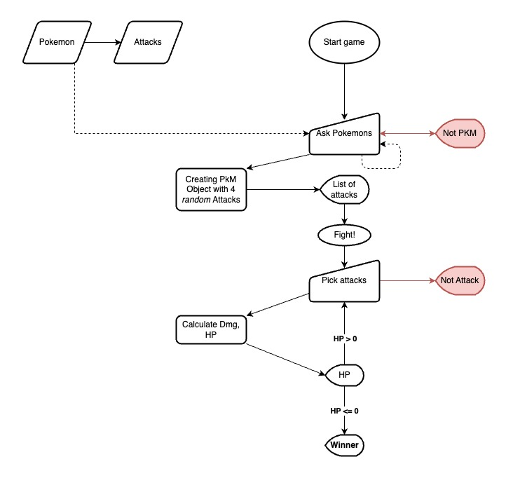

# Project-Pokemon-1
*Project between Panos and Jaime creating a pokemon fight simulator*

*DAFT2022, Paris, 14/10/2022*

## Content
- [Project Description](#project-description)
- [Rules](#rules)
- [Workflow](#workflow)
- [Organization](#organization)
- [Links](#links)

## Project Description
Two players, who each one choose a pokémon from a list of them given beforehand to fight.
Right after, the fight starts and the players will be asked to pick an attack.
The players will be fighting until one of the pokemon is dead, so we will have a winner!	

We chose this game based on nostalgia!

## Rules
Each player has to pick a pokemon out of the list of available pokemon (for the time being). And one of the moves that they are given.

## Workflow
JIRA planning
GitHub set up
Flowchart and pseudocode preparation
Started coding the classes, then the basic game logic, and then some extra features, such as advance damage calculation and type effectiveness.

## Organization
We used Sprints in JIRA and two GitHub repositories. We each updated our progress on JIRA and respectivelly pushed and pulled from our branches into 
each our main repositories and then created pull requests into the others.

The repository contains the flowchart that we used for the game data and logic, as well as the two main classes that we used to make the fight possible.

## Links

Include links to your repository, slides and kanban board. Feel free to include any other links associated with your project.

[Repository](https://github.com/)  
[Slides](https://slides.com/)  
[Trello](https://trello.com/en)  
